<!-- markdownlint-disable MD033 MD041 -->
<h1 align="center">ClearPort</h1>

<p align="center">
  <strong>The autonomous customs-recovery layer with an evaluation conscience that learns.</strong><br/>
  Diagnose rejections · Patch declarations · An eval-gate (Arize Phoenix when live) must approve every fix before any real-money action — and that gate gets better with experience.
</p>
<p align="center">
  
  
  
  
  
  
</p>

<p align="center">
  <a href="https://frontend-676765800108.us-east1.run.app/"></a>
  <a href="https://backend-676765800108.us-east1.run.app/health"></a>
  
  
  
</p>

<p align="center">
  Built for the <strong>Arize partner track</strong> of <em>Agents for Real-World Challenges</em> (Gemini hackathon).<br/>
  Runtime brain: <strong>Gemini 3</strong> on Vertex AI, driving a fully-traced Python recovery loop (also exposed as a Google ADK agent) · Trust layer: <strong>Arize Phoenix</strong> via <code>arize-phoenix-client</code> + <code>@arizeai/phoenix-mcp</code> + OpenInference/OTel.
</p>

---

## One-line definition

**ClearPort** is an autonomous customs-recovery layer that heals rejected cross-border shipping declarations — diagnosing the rejection, patching the declaration, and using **Arize Phoenix** as an *evaluation conscience* that must approve every fix against historically-accepted shipments before any real-money action. Low-risk fixes auto-clear; high-value or restricted ones escalate to a human; and every outcome becomes memory, so the same error self-heals next time. The eval-gate itself is **adaptive**: a learned judge anticipates the *destination* rejections the carrier never checks, generalising from independently-adjudicated outcomes, so it measurably improves as it accumulates experience.

---

## Live deployment

| Surface | URL | Notes |
|---------|-----|-------|
| **Dashboard (production)** | [frontend-676765800108.us-east1.run.app](https://frontend-676765800108.us-east1.run.app/) | Next.js on Cloud Run; the browser calls the backend Cloud Run URL directly (CORS) |
| **Backend API (HTTPS)** | [backend-676765800108.us-east1.run.app](https://backend-676765800108.us-east1.run.app/) | FastAPI + agents on Cloud Run |
| **Health check** | [backend-676765800108.us-east1.run.app/health](https://backend-676765800108.us-east1.run.app/health) | `{"status":"ok"}` when the service is up |
| **Phoenix UI** | [phoenix-676765800108.us-east1.run.app](https://phoenix-676765800108.us-east1.run.app/) | Traces, datasets, experiments (Cloud Run) |

> **Try it:** Open the [live dashboard](https://frontend-676765800108.us-east1.run.app/), click **Play full demo**, watch the eval-gate veto on the hard HS variant, approve an escalation, then **Trigger drift**. Full deploy guide: [`docs/DEPLOYMENT.md`](./docs/DEPLOYMENT.md).

---

## Demo video & prototype

### Watch the prototype

| Format | How to view |
|--------|-------------|
| **Live web demo** | [frontend-676765800108.us-east1.run.app](https://frontend-676765800108.us-east1.run.app/) — click **▶ Play full demo** for the full 6-beat + wildcard storyboard |
| **Console demo (offline)** | `uv run clearport-demo` — narrated walk-through, identical service code path |
<!-- | **Storyboard script** | [`docs/DEMO.md`](./docs/DEMO.md) — live-VM + Phoenix judge walkthrough with narration cues | -->

### Prototype screenshots

<!-- <p align="center">
  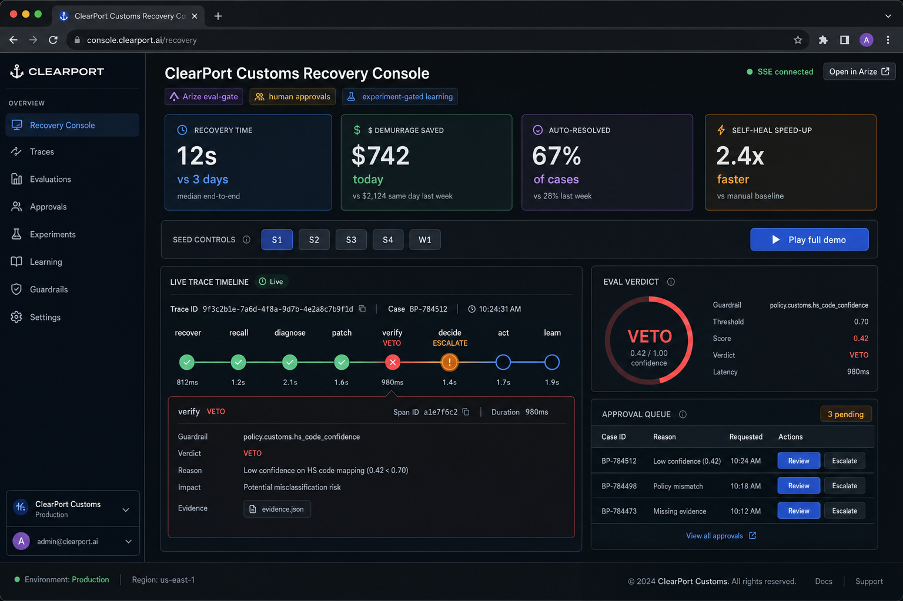
  <br/><em>Customs Recovery Console — live metrics, eval-gate verdicts, trace timeline, approval queue</em>
</p> -->

<!-- <p align="center">
  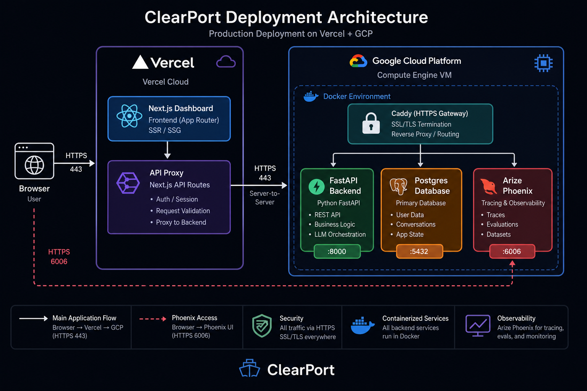
  <br/><em>Production topology — frontend, backend, and Phoenix on Cloud Run; pgvector (Postgres) on a GCE e2-small VM</em>
</p> -->


---

## The problem

<p align="center">
  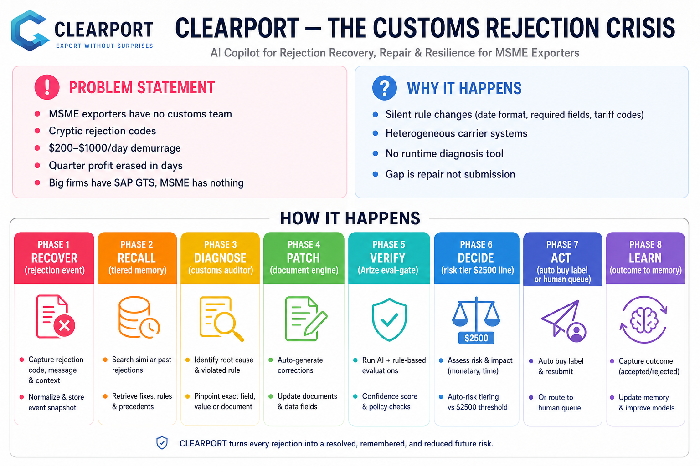
</p>

Small and medium exporters (MSMEs) have **no in-house customs team**. They file cross-border declarations through digital tools and hope they clear. When a destination silently changes a rule — a date format, a required field, a tariff code set — the filing is rejected with a **cryptic code**. The container sits at the dock accruing **demurrage of $200–$1,000+ per day**, and a few days of bureaucratic delay can erase a quarter's profit.

Big firms have SAP GTS and brokers on retainer. **The MSME has nothing.**

The unfilled gap is **not** document generation or submission (already solved by ShipEngine, EasyPost, Avalara). It is **runtime diagnosis and validated repair** of a gateway rejection. No existing tool parses the rejection, identifies the failing field, rewrites it, validates the fix against known-good submissions, and resubmits.

### Why it happens

- **Silent rule changes** — destinations update schemas without notice (date formats, required fields, tariff sets).
- **Heterogeneous systems** — carrier validation, regional registries, and customs law don't share a unified format.
- **No recovery layer** — existing tools generate and submit; they don't *heal* a rejection autonomously.

---

## Core novelty (the win condition)

The *parts* aren't new — HS classification and customs doc-gen exist. **The closed loop is:**

```text
diagnose → patch → eval-gate → tiered act → learn
```

…wrapped in an **evaluation conscience** and an **evolving, tiered memory**. Four properties make it defensible:

| Property | What it means |
|----------|---------------|
| **Eval-gate** | Arize Phoenix can **veto** a wrong fix on a high-value parcel *before* any spend |
| **Tiered human oversight** | Explicit, not implicit — a hard **$2,500** line triggers human review |
| **Outcomes become memory** | A fix enters permanent memory only after an experiment (deterministic offline; registered natively in Phoenix when enabled) **beats baseline**; the same error then **self-heals** autonomously |
| **The evaluator improves** | A learned judge anticipates *destination* rejections the carrier-side lint can't see, learning from independently-adjudicated outcomes — measured against an independent oracle, not itself, so the improvement is real and non-circular |

### Competitive landscape

| Capability | Zonos | ShipEngine/Shippo | EasyPost + Luma | Customs broker | **ClearPort** |
|---|:---:|:---:|:---:|:---:|:---:|
| HS-code classification | ✅ | partial | ❌ | manual | ✅ (or *calls* one) |
| Customs doc generation | ❌ | ✅ | ✅ | manual | ✅ |
| Live carrier submission | ❌ | ✅ | ✅ | manual | ✅ |
| **Diagnoses a rejection** | ❌ | ❌ | ❌ | ✅ slow | ✅ autonomous |
| **Patches & resubmits** | ❌ | ❌ | ❌ | ✅ manual | ✅ autonomous |
| **Eval gate before action** | ❌ | ❌ | ❌ | gut feel | ✅ **Arize** |
| **Tiered human oversight** | ❌ | ❌ | ❌ | implicit | ✅ explicit |
| **Learns from outcomes** | ░ | ❌ | ░ | ░ in head | ✅ trace→experiment |
| **Closed recovery loop** | ❌ | ❌ | ❌ | ✅ (human) | ✅ autonomous |

---

## Impact & benefits

<p align="center">
  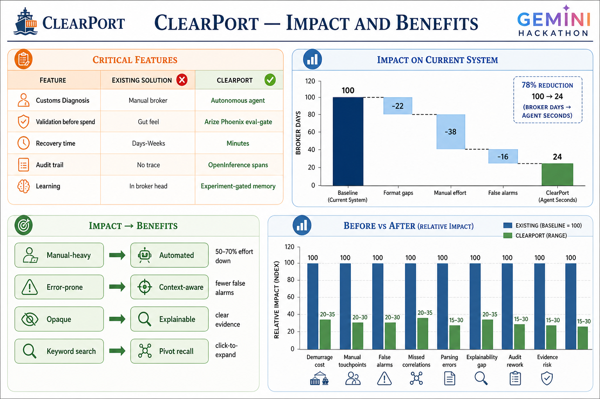
</p>

### The four headline metrics

Shown live on the dashboard and printed by `clearport-demo`:

| Metric | Definition | Assumption |
|--------|------------|------------|
| **Recovery time** | Agent-loop seconds vs broker-days baseline | Broker baseline = **3 days** |
| **$ demurrage saved** | `days_saved × $/day` per resolved shipment | **$250/day** demurrage per shipment |
| **% auto-resolved** | Auto ÷ total, with safe-escalation count alongside | Escalation is a *success*, not a failure |
| **Self-heal speed-up** | First-vs-repeat latency for the same memory key | Requires ≥ 2 observations of a key |

Assumptions are shown inline on the dashboard so numbers stay defensible.

---

## System architecture

<p align="center">
  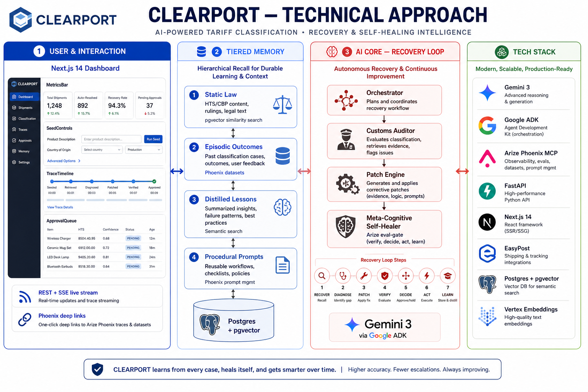
</p>

ClearPort is **layered**. Each layer is a clean boundary; arrows indicate real call/data direction.

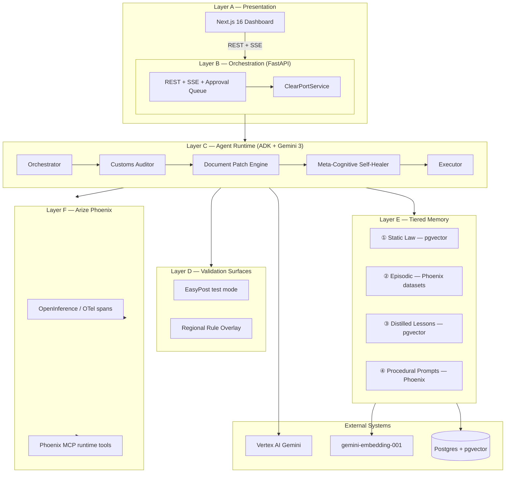

### Layer reference

| Layer | Component | Responsibility |
|-------|-----------|----------------|
| **A — Presentation** | Next.js 16 (App Router + Tailwind) | `Topbar`, `MetricsBar`, `SeedControls`, `TraceTimeline`, `EvalVerdictCard`, `ApprovalQueue`, `DriftBanner` |
| **B — Orchestration** | FastAPI on Cloud Run | `/api/recover`, `/api/events` (SSE), `/api/approvals`, `/api/metrics`, `/api/learn`, `/api/drift`, `/api/eval/benchmark`, `/api/eval/judge`, `/api/investigate/{run_id}` |
| **C — Agent runtime** | Google ADK + Gemini | Plain-Python closed loop (Orchestrator, Auditor, Patch Engine, Executor); "Self-Healer" is the eval/risk/learning/drift role. Also wrapped as an ADK `root_agent` |
| **D — Validation** | EasyPost + Regional Overlay | Real carrier rejections + controllable silent schema-change surface |
| **E — Memory** | Postgres/pgvector + Phoenix | ① law · ② episodic · ③ lessons · ④ prompts (Design B: semantic-first, **law has veto**) + an adjudication store (operational, mirrored into ②) |
| **F — Trust** | Arize Phoenix | Passive OTel tracing + active MCP access (datasets, experiments, prompts, evals) |

### Recovery pipeline

<p align="center">
  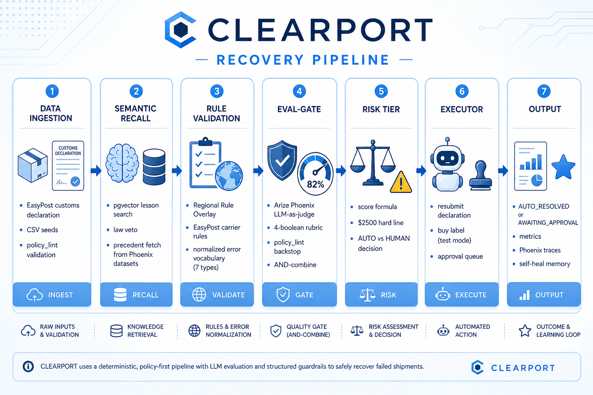
</p>

---

## The recovery loop

Each numbered step is a real **OpenTelemetry span** of the same name. Trace root = one `RejectionEvent`.

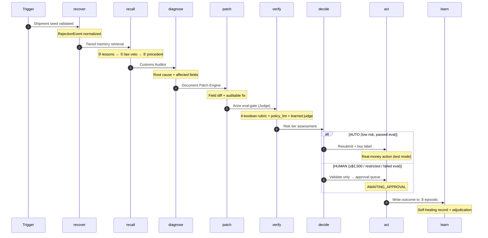

### Step-by-step

| Span | Agent / System | Output |
|------|----------------|--------|
| **recover** | Orchestrator | Root span — rejection id, error type, memory key, source (`easypost` \| `overlay`) |
| **recall** | Memory tier | `RecalledMemory` — lessons, law citations, precedents, vetoed lesson ids |
| **diagnose** | Customs Auditor | `Diagnosis` — root cause, affected fields, confidence (grounded on recalled citations) |
| **patch** | Document Patch Engine | `PatchProposal` — patched payload, field diffs, rationale, tool calls |
| **verify** | Eval-gate / Judge | `EvalVerdict` — passed, confidence, rubric (written as Phoenix annotation); a learned judge can tighten on adjudicated precedent |
| **decide** | Risk Tier | `RiskAssessment` — AUTO or HUMAN |
| **act** | Executor | Resubmit + buy label (AUTO) or queue for human (HUMAN) |
| **learn** | Self-Healer | Outcome → ② episodic memory; the resubmission is adjudicated by the independent oracle and stored as experience |

**Final status:** `AUTO_RESOLVED` \| `AWAITING_APPROVAL` \| `REJECTED`

### Memory recall sub-flow

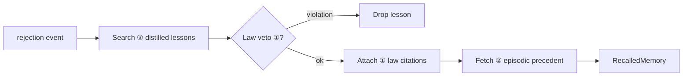

### Risk tier decision

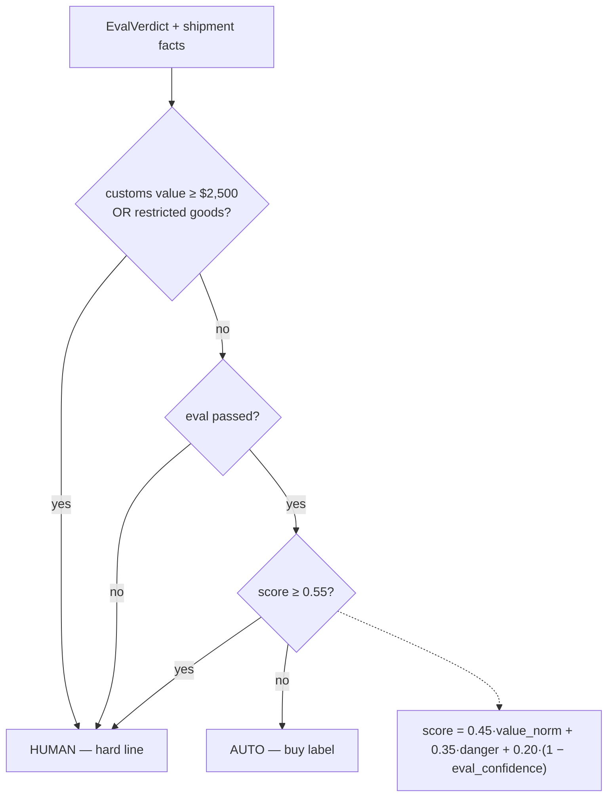

---

## Learning loop (② → ③ promotion)

Triggered by `/api/learn` or the demo runner:

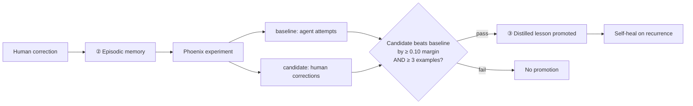

**Payoff:** When the same rejection recurs, `recall` finds the promoted lesson and `patch` self-heals from memory (`tool:memory-lesson`) — no classifier, no human, measurably faster.

---

## The adaptive eval-gate (evaluate the evaluator)

The eval-gate doesn't just *run* — it **learns**, and we measure that the learning is real rather than circular.

**The trap we avoid.** It's easy to "grade" an eval-gate with the very rule the gate already enforces (`policy_lint`). That makes "false-auto-clear ≈ 0" a tautology and the LLM non-load-bearing. ClearPort instead measures the gate against an **independent oracle** that models the *destination registry* — rules the carrier never checks — so the judge is graded by a different authority than the one it uses to decide.

| Piece | What it is | Why it's honest |
|-------|-----------|-----------------|
| **Independent oracle** (`eval/oracle.py`) | Ground truth about whether the **destination** would accept a (patched) declaration: an accepted-tariff-heading allow-list, a full-legal-name signer rule, and an undervaluation floor — plus, when live, an independent "destination customs officer" LLM with its own persona | Sourced **outside** the gate's `policy_lint`; rejects declarations the carrier accepts |
| **Adjudication memory** (`memory/adjudications.py`) | Every real destination outcome, embedded for semantic kNN retrieval; mirrored into the Phoenix episodic ② dataset when live | The judge's training signal is *observed outcomes*, never the gate's own logic |
| **Learned judge** (`eval/learned_judge.py`) | Predicts the destination verdict from semantically-similar precedent — similarity-weighted **kNN** offline, **Gemini few-shot** in-context learning live | Improves as the corpus grows; **nothing hard-coded** |

**It can only ever tighten, and it stays quiet until it has learned something.** The learned judge abstains until it has enough relevant precedent (default ≥ 3 neighbours above a similarity floor), so a cold store leaves the gate's behaviour identical to before. A confident veto (default: ≥ 60 % of similarity-weighted neighbours were rejected by the destination) fails an otherwise-passing gate; `accept`/`abstain` never loosen it. It defaults **off offline** (`auto` → on only when Phoenix is live), so the offline demo and tests are unaffected.

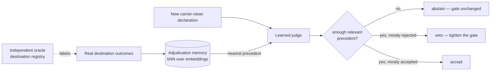

### The learning curve (the headline artifact)

`clearport-judge-eval` (`eval/judge_eval.py`) is the **meta-eval**: it generates a labelled suite of carrier-clean declarations, labels each by the independent oracle, then scores the gate (policy lint **+** learned judge) against that oracle while feeding the judge progressively more adjudicated experience. The offline reference run is deterministic:

| Experience (adjudications) | Accuracy | False-auto-clear | Recall on rejects |
|---:|---:|---:|---:|
| 0 (cold) | 50.0 % | 50.0 % | 0.0 % |
| 6 | 62.5 % | 37.5 % | 25.0 % |
| 12 | 68.75 % | 31.25 % | 37.5 % |
| 18 | 87.5 % | 12.5 % | 75.0 % |
| 24 (taught) | **100 %** | **0 %** | **100 %** |

A cold judge auto-clears the destination-restricted half of the suite; with experience it learns to anticipate those rejections, driving false-auto-clear to zero (**+50 % accuracy, cold → taught**). When Phoenix is live, the suite is registered as a **real experiment whose task actually runs the judge** (no label echo) and whose evaluators (`agrees_with_oracle`, `no_false_auto_clear`) score against the oracle — so the improvement is clickable in Phoenix.

> Reproduce locally: `uv run clearport-judge-eval` (offline, no keys) prints the metrics and the curve above.

---

## Drift detection (silent rule change)

Triggered by `/api/drift/{seed}`:

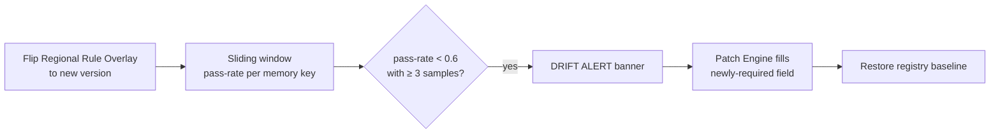

---

## Where Arize Phoenix is load-bearing

Phoenix is the project's trust layer. **When live**, it provides the eval-gate's `phoenix-evals` judge, the verdict **annotations** on the verify span, the episodic ② datasets (including the adjudication mirror), the promotion **experiment**, the synthetic **benchmark** experiment, the **judge-eval** ("evaluate the evaluator") experiment, prompt management ④, and end-to-end tracing. **Offline**, a deterministic backstop stands in for each (so the demo is reproducible with no keys) — but in the live system the conscience, the learning substrate, and the observability are all Phoenix.

| Role | Mechanism (live) | Phoenix surface |
|------|------------------|-----------------|
| **Eval-gate** | `phoenix-evals` LLM judge **AND** a deterministic policy backstop **AND** a learned judge — each can only *tighten*; must pass before any label is bought | `arize-phoenix-evals` (LiteLLM → Vertex `gemini-2.5-pro`) |
| **Verdict annotation** | Each verdict is written back onto the verify span | `arize-phoenix-client` `add_span_annotation` (`eval_gate`: label / score / explanation) |
| **Risk-tier input** | Eval confidence + an **expected-error-cost** term feed the auto-vs-human decision | derived from the verdict |
| **Episodic ② (read/write)** | Outcomes + human corrections mirrored to Phoenix datasets | `arize-phoenix-client` datasets (`clearport-outcomes`, `clearport-accepted-baseline`) |
| **Adjudication mirror** | Each independently-adjudicated destination outcome is mirrored into episodic ② (the learned judge's training corpus, visible in Phoenix) | `arize-phoenix-client` datasets (kind `adjudication`) |
| **Promotion gate (②→③)** | A real Phoenix **experiment** must beat baseline before a lesson is promoted | `arize-phoenix-client` `run_experiment` → real experiment id (deep-linked) |
| **Benchmark** | A synthetic labeled suite (9 recoverable slices across the error vocabulary, incl. an adversarial prompt-injection slice, + a clean control) → an experiment reporting correctness/safety/diagnosis **and** an independent-oracle false-auto-clear | `arize-phoenix-client` `run_experiment` + evaluators (`correct`, `safe`, `independent_safe`, `diagnosis`) |
| **Judge-eval (evaluate the evaluator)** | The judge-quality suite, registered as an experiment whose **task actually runs the judge** (no label echo) and whose evaluators score against the independent oracle | `arize-phoenix-client` `run_experiment` + evaluators (`agrees_with_oracle`, `no_false_auto_clear`) |
| **Procedural prompts ④** | Versioned reasoning templates (optional; default in-repo) | Phoenix prompt mgmt over **MCP** (`get-prompt-by-identifier`, `upsert-prompt`) |
| **Tracing / drift** | Every loop step is a span | OpenInference/OTel → Phoenix |
| **Investigate (on-demand)** | Read a run's `eval_gate` annotation back **over MCP** | `@arizeai/phoenix-mcp` `get-span-annotations` via `POST /api/investigate/{run_id}` |

**Client vs MCP — the request hot path is npx-free.** The per-request recovery loop uses the in-process **`arize-phoenix-client`** (HTTP) for evals, span annotations, datasets, and experiments — reliable, with no Node in the request path. **`@arizeai/phoenix-mcp`** (the Model Context Protocol surface, launched via `npx`) is used in four explicit, non-hot-path places: the **startup handshake** (`clearport-mcp-handshake` / `verify_tooling`) that asserts the required tools exist, the **ADK agent toolset** (the Agent-Builder surface), the **on-demand `/api/investigate`** read-back (`get-span-annotations`), and **prompt management ④** when `CLEARPORT_PROMPTS_BACKEND=phoenix`. OTel stays passive (trace emission); MCP is explicit, on-demand runtime access — not something the loop reasons through on every request.

---

## Data contracts

| Object | Description |
|--------|-------------|
| `RejectionEvent` | Trace root — source, lane, persona, `CustomsPayload`, raw/normalized error, seed id |
| `CustomsPayload` | Mutable mirror of EasyPost `CustomsInfo` (signer, explanation, restriction, items, …) |
| `MemoryKey` | `{lane \| hs_chapter \| error_type}` — granularity of all memory |
| `Diagnosis` | Root cause + affected fields + confidence |
| `PatchProposal` | Patched payload + `FieldDiff[]` + rationale |
| `EvalVerdict` | Passed + confidence + `EvalRubric` (4 booleans) + optional `LearnedVerdict` |
| `RiskAssessment` | AUTO/HUMAN + score + hard-line flag |
| `Outcome` | Final loop result written to ② |
| `DistilledLesson` | Promoted fix in ③ |
| `Adjudication` | An independent destination outcome (accepted/rejected + source) — the learned judge's training signal |
| `LearnedVerdict` | The learned judge's opinion: `accept` / `veto` / `abstain` + evidence-derived confidence + neighbours used |
| `JudgeEvalReport` | Judge-quality metrics vs the independent oracle + the learning curve |

**Normalized error vocabulary (7):** `HS_INVALID` · `EEI_THRESHOLD_MISMATCH` · `RESTRICTION_COMMENTS_MISSING` · `SIGNER_MISSING` · `CONTENTS_EXPLANATION_MISSING` · `ZERO_VALUE` · `OVERLAY_SCHEMA_DRIFT`

---

## What's real vs. simulated

ClearPort runs **100% offline by default** — every external dependency has a deterministic fallback. Flip to live services via env vars, never by changing code.

| Capability | Offline (default) | Live (optional) |
|------------|-------------------|-----------------|
| Carrier validation | `policy_lint` (same EasyPost rules) | Real EasyPost test mode |
| Eval-gate | Deterministic policy backstop | Backstop **AND** Gemini judge **AND** learned judge |
| Adaptive judge | kNN over adjudicated precedent | Gemini few-shot in-context learning |
| Destination oracle | Deterministic destination registry | + independent "destination officer" LLM |
| Learning | Real deterministic experiment | Phoenix datasets/experiments |
| Drift | Real monitor over simulated registry | Same |
| Embeddings | Local feature-hashing (3072-d) | Vertex `gemini-embedding-001` |
| LLM reasoning | Deterministic rule-based fallback | Gemini 3 |
| Tracing | Best-effort no-op | OpenInference → Phoenix |

**Scope guardrails:** EasyPost test mode only; never files to real government customs; Regional Overlay simulates a destination registry; structural/syntactic corrections only — final legal classification of high-value or restricted goods always routes to a human.

---

## Tech stack

| Category | Technology |
|----------|------------|
| Language | Python 3.12 |
| Agent framework | Google ADK `root_agent` surface (`adk_app.py`) over a plain-Python, fully-traced recovery loop |
| LLM | Gemini 3 on Vertex AI via `CLEARPORT_GEMINI_MODEL` (repo default `gemini-3-pro`; hosted demo runs `gemini-2.5-pro`) |
| Embeddings | Vertex `gemini-embedding-001` (3072-d) when live; deterministic local hashing (3072-d) offline |
| Tracing / evals | `arize-phoenix-otel`, `arize-phoenix-evals`, OpenInference instrumentors |
| MCP | `mcp` client → `@arizeai/phoenix-mcp` via `npx` |
| Carrier | EasyPost (test mode) |
| Backend | FastAPI + Uvicorn + `sse-starlette` |
| Dashboard | Next.js 16 (App Router) + Tailwind |
| Persistence | Postgres + pgvector (SQLAlchemy + psycopg) — a container on a small GCE VM (e2-small); schema from `infra/cloudsql/001_init.sql` |
| Secrets / creds | Cloud Run service config + the service's attached service account (ADC); no secrets in the repo |
| Local dev | Docker Compose (Phoenix `:6006`, Postgres `:5432`) |
| Logging | structlog |

**Console entry points:** `clearport-api` · `clearport-demo` · `clearport-hello-trace` · `clearport-mcp-handshake` · `clearport-judge-eval`

---

## Deployment topology

The hosted demo runs the three application services on **Google Cloud Run** (frontend, backend, Phoenix), each independently scalable, with **pgvector (Postgres)** as a container on a small **GCE e2-small VM** for persistent memory ①/③. The browser calls the backend Cloud Run URL directly (CORS-enabled), so there is no server-side proxy in the request path.

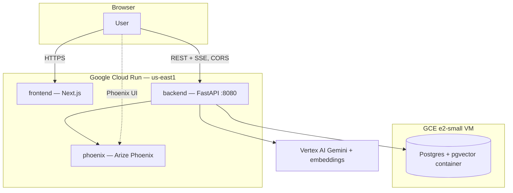

| Resource | Service |
|----------|---------|
| Cloud Run — `frontend` | Next.js dashboard; browser hits it over HTTPS, then calls the backend Cloud Run URL directly |
| Cloud Run — `backend` | FastAPI + agents (REST + SSE), CORS-enabled for the frontend origin |
| Cloud Run — `phoenix` | Arize Phoenix — traces, datasets, experiments, prompts |
| GCE e2-small VM | Postgres + pgvector container — memory ①/③ + app state |
| Vertex AI | Gemini (hosted demo: `gemini-2.5-pro`) + embeddings, via the service's attached service account |

**Config-only switching** — every live backend toggled by env var (the hosted demo sets `pg` + `auto` embeddings + `phoenix-client`):

```text
CLEARPORT_VECTOR_BACKEND=pg                # pgvector for memory ①/③
CLEARPORT_EMBEDDINGS_BACKEND=vertex        # or "auto" (Vertex when a GCP project is set)
CLEARPORT_EPISODIC_BACKEND=phoenix-client  # in-process Phoenix client for ② datasets; "phoenix" uses MCP
CLEARPORT_PROMPTS_BACKEND=phoenix          # Phoenix prompt mgmt for ④ over MCP; default "local" in-repo templates
CLEARPORT_EVALS_ENABLED=on                 # phoenix-evals judge (LiteLLM→Vertex); "auto" = on when Phoenix is live
CLEARPORT_ANNOTATIONS_ENABLED=on           # write each eval verdict back as an `eval_gate` span annotation
CLEARPORT_PHOENIX_EXPERIMENTS=on           # register real Phoenix experiments (promotion + benchmark)
CLEARPORT_MCP_ENABLED=on                   # on-demand /api/investigate read-back over MCP; "auto" follows Phoenix-live
CLEARPORT_LEARNED_JUDGE=on                 # adaptive judge tightens the gate from adjudicated precedent; "auto" = on when Phoenix is live
CLEARPORT_ORACLE_OFFICER=on                # independent "destination officer" LLM augments the oracle (opt-in even when live)
```

Deploy scripts: `infra/deploy/setup_gcp.sh` · `deploy_backend.sh` · `deploy_dashboard.sh` · `vm_deploy.sh`

Full guide with screenshots and verification checklist: **[`docs/DEPLOYMENT.md`](./docs/DEPLOYMENT.md)**

---

## Quickstart

| Mode | Command | Docs |
|------|---------|------|
| **Live demo** | [frontend-676765800108.us-east1.run.app](https://frontend-676765800108.us-east1.run.app/) | This README |
| Offline demo | `uv run clearport-demo` | [`GUIDE.md`](./GUIDE.md) |
| Local UI | `uv run clearport-api` + `cd dashboard && npm run dev` | [`dashboard/README.md`](./dashboard/README.md) |
| Cloud Run + pgvector VM | Frontend / backend / Phoenix on Cloud Run, Postgres on an e2-small VM | [`docs/DEPLOYMENT.md`](./docs/DEPLOYMENT.md) |

### Option A — 60-second offline demo (no keys)

```bash
uv sync --extra dev
uv run clearport-demo            # narrated walk-through of all 6 beats + wildcard
uv run clearport-judge-eval      # evaluate the evaluator → prints the learning curve
uv run pytest -ra                # same beats, asserted as tests
```

### Option B — backend + live dashboard

```bash
uv run clearport-api             # http://localhost:8080
cd dashboard && cp .env.local.example .env.local && npm install && npm run dev
```

Open <http://localhost:3000>, fire a seed, watch the loop stream live.

### Option C — full live stack

```bash
cp .env.example .env
docker compose up -d             # local Phoenix + Postgres
uv sync --extra dev
uv run clearport-hello-trace     # one Gemini call → Phoenix trace
uv run clearport-mcp-handshake   # confirms Phoenix MCP + required tools
```


---

## Run the tests

```bash
uv run pytest -ra                                    # full suite, offline & deterministic
uv run pytest tests/unit/test_loop_offline.py -ra   # locked demo beats
uv run pytest tests/unit/test_promotion.py -ra      # veto → learn → self-heal
uv run pytest tests/unit/test_adaptive_judge.py -ra # oracle independence + judge learning curve
```

---

## Infographic reference (style guide)

The four presentation infographics above follow the hackathon slide template style. Original reference layouts are preserved in [`docs/assets/infographics/`](./docs/assets/infographics/) for comparison:

| Reference | ClearPort adaptation |
|-----------|---------------------|
| `03-problem-statement-reference.png` | `clearport-problem-recovery-loop.png` |
| `01-impact-benefits-reference.png` | `clearport-impact-benefits.png` |
| `02-technical-approach-reference.png` | `clearport-technical-architecture.png` |
| `04-pipeline-reference.png` | `clearport-recovery-pipeline.png` |

---

## Project status

- [x] **Phase 0–11** — Full stack: agents, eval-gate, HITL, learning, drift, dashboard, metrics, demo
- [x] Public repo · **Apache-2.0**
- [x] **Gemini 3** (Vertex AI) + **Google ADK** `root_agent` surface
- [x] **Arize Phoenix** load-bearing via `@arizeai/phoenix-mcp` + OpenInference OTel
- [x] **Adaptive eval-gate** — a learned judge measured against an independent oracle (`clearport-judge-eval`)
- [x] [Live deployment](https://frontend-676765800108.us-east1.run.app/) on Cloud Run + a pgvector VM
- [x] Reproducible offline path (no keys)
- [x] Four impact metrics on screen with stated assumptions

Implementation plan: [`ClearPort-Implementation-Plan.md`](../ClearPort-Implementation-Plan.md)

---

## License

[Apache-2.0](./LICENSE) © 2026 ClearPort Contributors.

> ClearPort uses EasyPost **test mode** only and synthetic shipper data. It does not file to government customs authorities; the Regional Rule Overlay simulates a destination registry for drift demonstration. The agent performs structural and syntactic customs corrections; final legal classification of high-value or restricted goods is always routed to a human.
