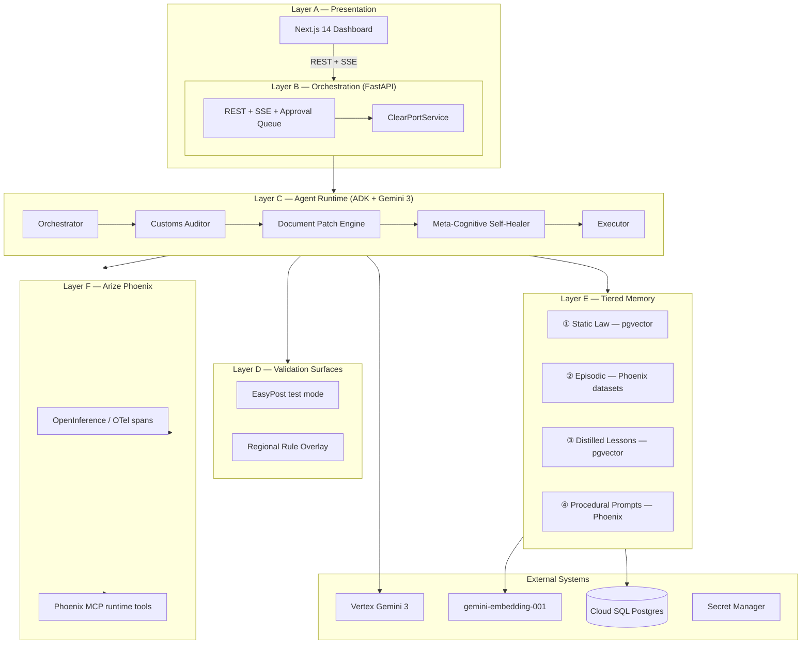
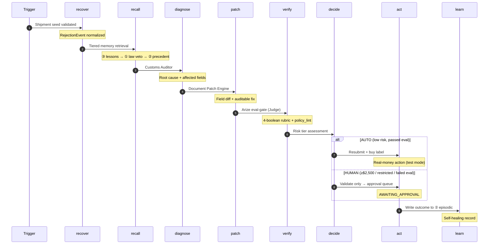
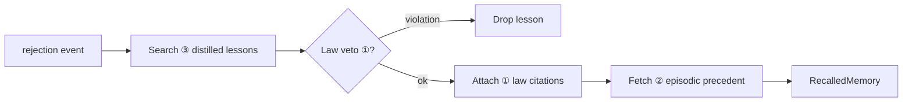
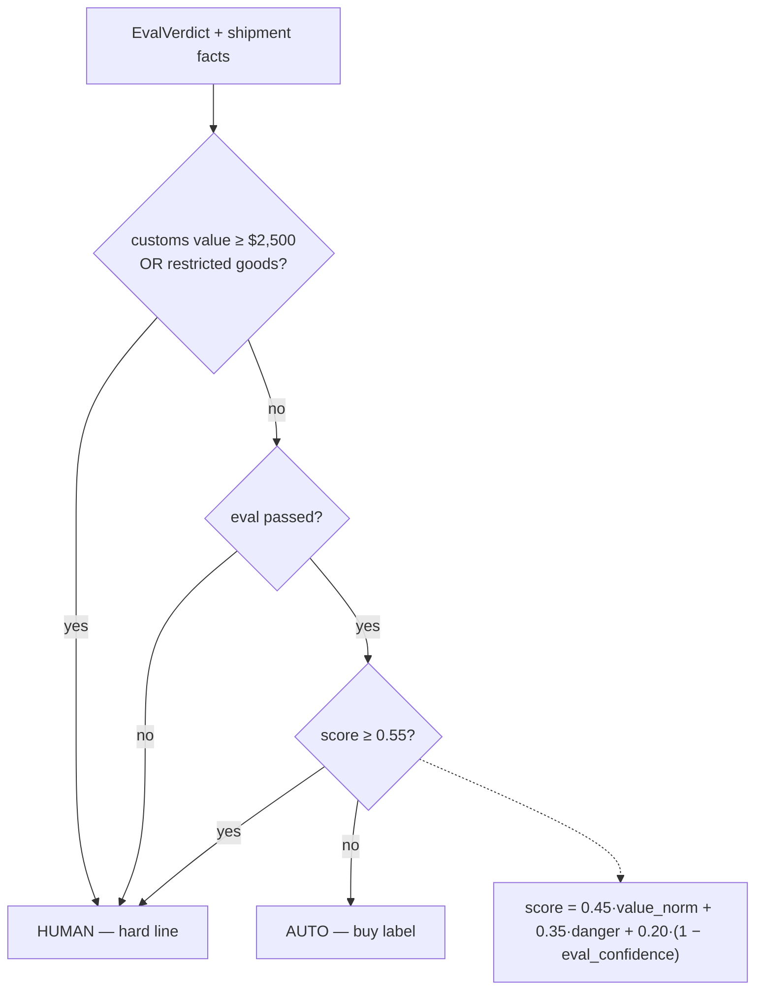
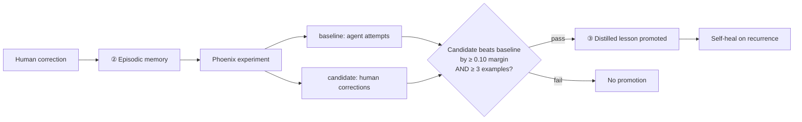
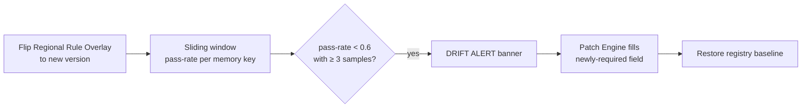
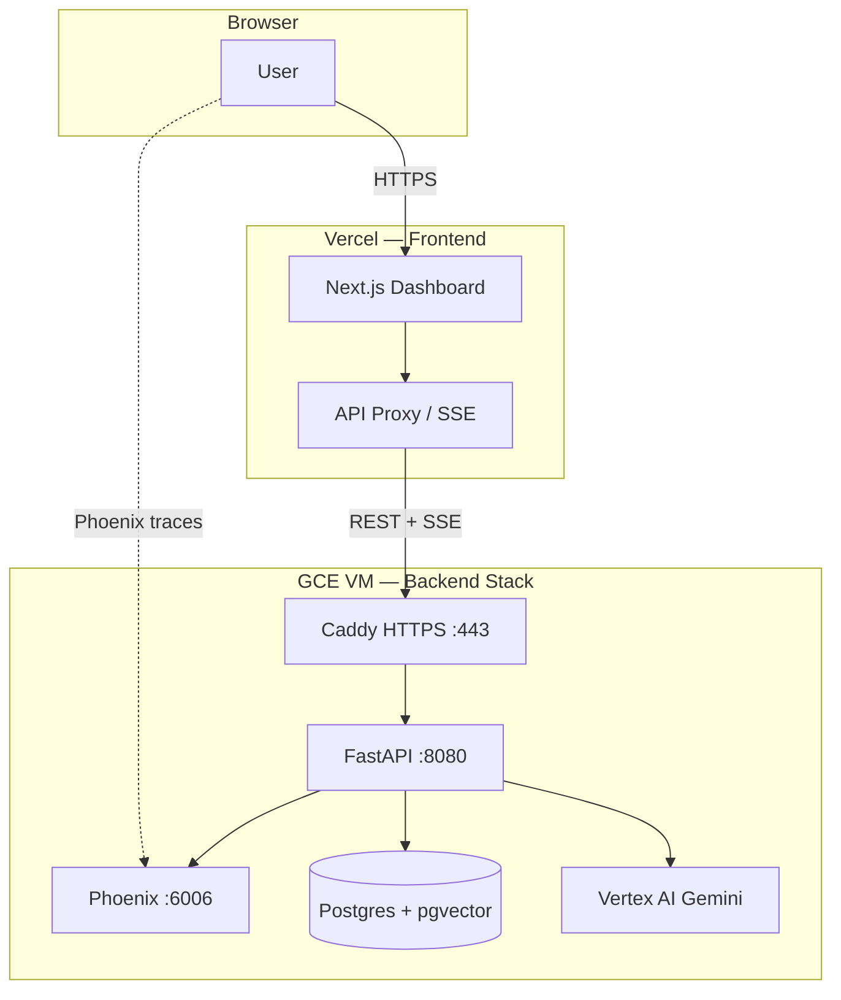

<!-- markdownlint-disable MD033 MD041 -->
<p align="center">
  
</p>

<h1 align="center">ClearPort</h1>

<p align="center">
  <strong>The autonomous customs-recovery layer with an evaluation conscience.</strong><br/>
  Diagnose rejections · Patch declarations · Arize Phoenix must approve every fix before any real-money action.
</p>

<p align="center">
  <a href="https://clearport-dynamite.vercel.app/"></a>
  <a href="https://34-134-197-83.sslip.io/health"></a>
  
  
  
</p>

<p align="center">
  Built for the <strong>Arize partner track</strong> of <em>Agents for Real-World Challenges</em> (Gemini hackathon).<br/>
  Runtime brain: <strong>Gemini 3</strong> on Google Cloud Agent Builder (ADK) · Trust layer: <strong>Arize Phoenix</strong> via <code>@arizeai/phoenix-mcp</code> + OpenInference/OTel.
</p>

---

## One-line definition

**ClearPort** is an autonomous customs-recovery layer that heals rejected cross-border shipping declarations — diagnosing the rejection, patching the declaration, and using **Arize Phoenix** as an *evaluation conscience* that must approve every fix against historically-accepted shipments before any real-money action. Low-risk fixes auto-clear; high-value or restricted ones escalate to a human; and every outcome becomes memory, so the same error self-heals next time.

---

## Live deployment

| Surface | URL | Notes |
|---------|-----|-------|
| **Dashboard (production)** | [**clearport-dynamite.vercel.app**](https://clearport-dynamite.vercel.app/) | Next.js on Vercel — REST + SSE proxied server-side |
| **Backend API (HTTPS)** | [https://34-134-197-83.sslip.io](https://34-134-197-83.sslip.io) | FastAPI + agents on GCP VM (Caddy TLS) |
| **Health check** | [https://34-134-197-83.sslip.io/health](https://34-134-197-83.sslip.io/health) | `{"status":"ok"}` when stack is up |
| **Phoenix UI** | [http://34.134.197.83:6006](http://34.134.197.83:6006) | Traces, datasets, experiments (raw port; firewall-dependent) |
| **Raw UI (VM)** | `http://34.134.197.83:3000` | Dashboard container when not on Vercel |
| **Raw API (VM)** | `http://34.134.197.83:8080/health` | Direct backend port |

> **Try it:** Open the [live dashboard](https://clearport-dynamite.vercel.app/), click **Play full demo**, watch the eval-gate veto on the hard HS variant, approve an escalation, then **Trigger drift**. Full deploy guide: [`docs/DEPLOYMENT.md`](./docs/DEPLOYMENT.md).

---

## Demo video & prototype

### Watch the prototype

| Format | How to view |
|--------|-------------|
| **Live web demo** | [clearport-dynamite.vercel.app](https://clearport-dynamite.vercel.app/) — click **▶ Play full demo** for the full 6-beat + wildcard storyboard |
| **Console demo (offline)** | `uv run clearport-demo` — narrated walk-through, identical service code path (best for screen-recording) |
| **Storyboard script** | [`docs/DEMO.md`](./docs/DEMO.md) — ~3-minute judge walkthrough with narration cues |

### Prototype screenshots

<p align="center">
  
  <br/><em>Customs Recovery Console — live metrics, eval-gate verdicts, trace timeline, approval queue</em>
</p>

<p align="center">
  
  <br/><em>Production topology — Vercel frontend proxies REST + SSE to GCP backend stack</em>
</p>

> **Recording tip:** Lead with the **eval-gate VETO** (hard HS variant), pay off with **self-heal from memory**, close on the **drift alert**. See [`docs/DEMO.md`](./docs/DEMO.md) for beat-by-beat narration.

---

## The problem

<p align="center">
  
</p>

Small and medium exporters (MSMEs) have **no in-house customs team**. They file cross-border declarations through digital tools and hope they clear. When a destination silently changes a rule — a date format, a required field, a tariff code set — the filing is rejected with a **cryptic code**. The container sits at the dock accruing **demurrage of $200–$1,000+ per day**, and a few days of bureaucratic delay can erase a quarter's profit.

Big firms have SAP GTS and brokers on retainer. **The MSME has nothing.**

The unfilled gap is **not** document generation or submission (already solved by ShipEngine, EasyPost, Avalara). It is **runtime diagnosis and validated repair** of a gateway rejection. No existing tool parses the rejection, identifies the failing field, rewrites it, validates the fix against known-good submissions, and resubmits.

### Why it happens

- **Silent rule changes** — destinations update schemas without notice (date formats, required fields, tariff sets).
- **Heterogeneous systems** — carrier validation, regional registries, and customs law don't share a unified format.
- **No recovery layer** — existing tools generate and submit; they don't *heal* a rejection autonomously.

---

## Core novelty (the win condition)

The *parts* aren't new — HS classification and customs doc-gen exist. **The closed loop is:**

```text
diagnose → patch → eval-gate → tiered act → learn
```

…wrapped in an **evaluation conscience** and an **evolving, tiered memory**. Three properties make it defensible:

| Property | What it means |
|----------|---------------|
| **Eval-gate** | Arize Phoenix can **veto** a wrong fix on a high-value parcel *before* any spend |
| **Tiered human oversight** | Explicit, not implicit — a hard **$2,500** line triggers human review |
| **Outcomes become memory** | A fix enters permanent memory only after a Phoenix experiment **beats baseline**; the same error then **self-heals** autonomously |

### Competitive landscape

| Capability | Zonos | ShipEngine/Shippo | EasyPost + Luma | Customs broker | **ClearPort** |
|---|:---:|:---:|:---:|:---:|:---:|
| HS-code classification | ✅ | partial | ❌ | manual | ✅ (or *calls* one) |
| Customs doc generation | ❌ | ✅ | ✅ | manual | ✅ |
| Live carrier submission | ❌ | ✅ | ✅ | manual | ✅ |
| **Diagnoses a rejection** | ❌ | ❌ | ❌ | ✅ slow | ✅ autonomous |
| **Patches & resubmits** | ❌ | ❌ | ❌ | ✅ manual | ✅ autonomous |
| **Eval gate before action** | ❌ | ❌ | ❌ | gut feel | ✅ **Arize** |
| **Tiered human oversight** | ❌ | ❌ | ❌ | implicit | ✅ explicit |
| **Learns from outcomes** | ░ | ❌ | ░ | ░ in head | ✅ trace→experiment |
| **Closed recovery loop** | ❌ | ❌ | ❌ | ✅ (human) | ✅ autonomous |

---

## Impact & benefits

<p align="center">
  
</p>

### The four headline metrics

Shown live on the dashboard and printed by `clearport-demo`:

| Metric | Definition | Assumption |
|--------|------------|------------|
| **Recovery time** | Agent-loop seconds vs broker-days baseline | Broker baseline = **3 days** |
| **$ demurrage saved** | `days_saved × $/day` per resolved shipment | **$250/day** demurrage per shipment |
| **% auto-resolved** | Auto ÷ total, with safe-escalation count alongside | Escalation is a *success*, not a failure |
| **Self-heal speed-up** | First-vs-repeat latency for the same memory key | Requires ≥ 2 observations of a key |

Assumptions are shown inline on the dashboard so numbers stay defensible.

---

## System architecture

<p align="center">
  
</p>

ClearPort is **layered**. Each layer is a clean boundary; arrows indicate real call/data direction.



### Layer reference

| Layer | Component | Responsibility |
|-------|-----------|----------------|
| **A — Presentation** | Next.js 14 (App Router + Tailwind) | `Topbar`, `MetricsBar`, `SeedControls`, `TraceTimeline`, `EvalVerdictCard`, `ApprovalQueue`, `DriftBanner` |
| **B — Orchestration** | FastAPI on Cloud Run / GCE | `/api/recover`, `/api/events` (SSE), `/api/approvals`, `/api/metrics`, `/api/learn`, `/api/drift` |
| **C — Agent runtime** | Google ADK + Gemini 3 | Four agents over one closed loop (Orchestrator, Auditor, Patch Engine, Self-Healer + Executor) |
| **D — Validation** | EasyPost + Regional Overlay | Real carrier rejections + controllable silent schema-change surface |
| **E — Memory** | Postgres/pgvector + Phoenix | ① law · ② episodic · ③ lessons · ④ prompts (Design B: semantic-first, **law has veto**) |
| **F — Trust** | Arize Phoenix | Passive OTel tracing + active MCP access (datasets, experiments, prompts, evals) |

### Recovery pipeline

<p align="center">
  
</p>

---

## The recovery loop

Each numbered step is a real **OpenTelemetry span** of the same name. Trace root = one `RejectionEvent`.



### Step-by-step

| Span | Agent / System | Output |
|------|----------------|--------|
| **recover** | Orchestrator | Root span — rejection id, error type, memory key, source (`easypost` \| `overlay`) |
| **recall** | Memory tier | `RecalledMemory` — lessons, law citations, precedents, vetoed lesson ids |
| **diagnose** | Customs Auditor | `Diagnosis` — root cause, affected fields, confidence (grounded on recalled citations) |
| **patch** | Document Patch Engine | `PatchProposal` — patched payload, field diffs, rationale, tool calls |
| **verify** | Eval-gate / Judge | `EvalVerdict` — passed, confidence, rubric (written as Phoenix annotation) |
| **decide** | Risk Tier | `RiskAssessment` — AUTO or HUMAN |
| **act** | Executor | Resubmit + buy label (AUTO) or queue for human (HUMAN) |
| **learn** | Self-Healer | Outcome → ② episodic memory |

**Final status:** `AUTO_RESOLVED` \| `AWAITING_APPROVAL` \| `REJECTED`

### Memory recall sub-flow



### Risk tier decision



---

## Learning loop (② → ③ promotion)

Triggered by `/api/learn` or the demo runner:



**Payoff:** When the same rejection recurs, `recall` finds the promoted lesson and `patch` self-heals from memory (`tool:memory-lesson`) — no classifier, no human, measurably faster.

---

## Drift detection (silent rule change)

Triggered by `/api/drift/{seed}`:



---

## Where Arize Phoenix is load-bearing

Remove Phoenix and the system stops working.

| Role | Mechanism | Phoenix surface / MCP tools |
|------|-----------|----------------------------|
| **Eval-gate** | LLM-as-judge must pass before any label is bought | `arize-phoenix-evals`; verdict → annotation |
| **Risk tier input** | Eval confidence feeds auto-vs-human decision | Derived from verdict |
| **Precedent recall (②)** | Read episodic memory | `list-datasets`, `get-dataset-examples` |
| **Write outcomes (②)** | Self-heal record + human corrections | `add-dataset-examples` |
| **Promotion gate (②→③)** | Experiment must beat baseline | `list-experiments-for-dataset`, `get-experiment-by-id` |
| **Procedural prompts (④)** | Versioned reasoning | `list/get/upsert-prompt`, version tags |
| **Tracing / drift** | Every step is a span | OpenInference/OTel; `get-trace`, `get-spans`, `get-span-annotations` |

**MCP vs OTel split:** OTel = passive trace emission; Phoenix MCP = active runtime access to memory, datasets, experiments, and prompts. Required tools are asserted at handshake (`clearport-mcp-handshake`).

---

## Data contracts

| Object | Description |
|--------|-------------|
| `RejectionEvent` | Trace root — source, lane, persona, `CustomsPayload`, raw/normalized error, seed id |
| `CustomsPayload` | Mutable mirror of EasyPost `CustomsInfo` (signer, explanation, restriction, items, …) |
| `MemoryKey` | `{lane \| hs_chapter \| error_type}` — granularity of all memory |
| `Diagnosis` | Root cause + affected fields + confidence |
| `PatchProposal` | Patched payload + `FieldDiff[]` + rationale |
| `EvalVerdict` | Passed + confidence + `EvalRubric` (4 booleans) |
| `RiskAssessment` | AUTO/HUMAN + score + hard-line flag |
| `Outcome` | Final loop result written to ② |
| `DistilledLesson` | Promoted fix in ③ |

**Normalized error vocabulary (7):** `HS_INVALID` · `EEI_THRESHOLD_MISMATCH` · `RESTRICTION_COMMENTS_MISSING` · `SIGNER_MISSING` · `CONTENTS_EXPLANATION_MISSING` · `ZERO_VALUE` · `OVERLAY_SCHEMA_DRIFT`

---

## What's real vs. simulated

ClearPort runs **100% offline by default** — every external dependency has a deterministic fallback. Flip to live services via env vars, never by changing code.

| Capability | Offline (default) | Live (optional) |
|------------|-------------------|-----------------|
| Carrier validation | `policy_lint` (same EasyPost rules) | Real EasyPost test mode |
| Eval-gate | Deterministic policy backstop | Backstop **AND** Gemini judge |
| Learning | Real deterministic experiment | Phoenix datasets/experiments |
| Drift | Real monitor over simulated registry | Same |
| Embeddings | Local feature-hashing (3072-d) | Vertex `gemini-embedding-001` |
| LLM reasoning | Deterministic rule-based fallback | Gemini 3 |
| Tracing | Best-effort no-op | OpenInference → Phoenix |

**Scope guardrails:** EasyPost test mode only; never files to real government customs; Regional Overlay simulates a destination registry; structural/syntactic corrections only — final legal classification of high-value or restricted goods always routes to a human.

---

## Tech stack

| Category | Technology |
|----------|------------|
| Language | Python 3.12 |
| Agent framework | Google ADK on Vertex AI Agent Builder |
| LLM | Gemini 3 (`gemini-3-pro`) |
| Embeddings | Vertex `gemini-embedding-001` (3072-d) |
| Tracing / evals | `arize-phoenix-otel`, `arize-phoenix-evals`, OpenInference instrumentors |
| MCP | `mcp` client → `@arizeai/phoenix-mcp` via `npx` |
| Carrier | EasyPost (test mode) |
| Backend | FastAPI + Uvicorn + `sse-starlette` |
| Dashboard | Next.js 14 + Tailwind |
| Persistence | Postgres + pgvector (SQLAlchemy + psycopg) on Cloud SQL |
| Secrets | Google Secret Manager |
| Local dev | Docker Compose (Phoenix `:6006`, Postgres `:5432`) |
| Logging | structlog |

**Console entry points:** `clearport-api` · `clearport-demo` · `clearport-hello-trace` · `clearport-mcp-handshake`

---

## Deployment topology



| Resource | Service |
|----------|---------|
| Cloud Run × 2 | FastAPI backend, Next.js dashboard (or Vercel for frontend) |
| Cloud SQL | Postgres + pgvector — memory ①/③ + app state |
| Phoenix Cloud / local | Traces, datasets, experiments, prompts |
| Vertex AI | Gemini 3 + embeddings |
| Secret Manager | API keys (none in repo) |

**Config-only switching** — every live backend toggled by env var:

```text
CLEARPORT_VECTOR_BACKEND=pg
CLEARPORT_EMBEDDINGS_BACKEND=vertex
CLEARPORT_EPISODIC_BACKEND=phoenix
CLEARPORT_PROMPTS_BACKEND=phoenix
```

Deploy scripts: `infra/deploy/setup_gcp.sh` · `deploy_backend.sh` · `deploy_dashboard.sh` · `vm_deploy.sh`

Full guide with screenshots and verification checklist: **[`docs/DEPLOYMENT.md`](./docs/DEPLOYMENT.md)**

---

## Quickstart

| Mode | Command | Docs |
|------|---------|------|
| **Live demo** | [clearport-dynamite.vercel.app](https://clearport-dynamite.vercel.app/) | This README |
| Offline demo | `uv run clearport-demo` | [`GUIDE.md`](./GUIDE.md) |
| Local UI | `uv run clearport-api` + `cd dashboard && npm run dev` | [`dashboard/README.md`](./dashboard/README.md) |
| Vercel + GCP split | Backend on VM, dashboard on Vercel | [`docs/DEPLOYMENT.md`](./docs/DEPLOYMENT.md) |
| Full VM stack | `./infra/deploy/vm_deploy.sh` | [`infra/deploy/README.md`](./infra/deploy/README.md) |

### Option A — 60-second offline demo (no keys)

```bash
uv sync --extra dev
uv run clearport-demo            # narrated walk-through of all 6 beats + wildcard
uv run pytest -ra                # same beats, asserted as tests
```

### Option B — backend + live dashboard

```bash
uv run clearport-api             # http://localhost:8080
cd dashboard && cp .env.local.example .env.local && npm install && npm run dev
```

Open <http://localhost:3000>, fire a seed, watch the loop stream live.

### Option C — full live stack

```bash
cp .env.example .env
docker compose up -d             # local Phoenix + Postgres
uv sync --extra dev
uv run clearport-hello-trace     # one Gemini call → Phoenix trace
uv run clearport-mcp-handshake   # confirms Phoenix MCP + required tools
```

---

## Demo storyboard

**Hero persona:** India → US handicrafts MSME (Anaya Handicrafts → Dana Mercer).

| Beat | Seed | What happens | Hero moment |
|------|------|--------------|-------------|
| 1 | S4 | Missing `customs_signer` → fast AUTO heal | Eval **PASS**, label bought |
| 2 | Hard HS | Eval-gate **VETO** → escalate | **Money shot** — no spend |
| 3 | — | Human corrects HS `830249` → **Run learning** → lesson **promoted** | Phoenix experiment beats baseline |
| 4 | Same HS | Self-heals from memory (not classifier) | Self-heal speed-up rises |
| 5 | S2 | Value > $2,500 → hard-line **ESCALATE** | Human approves |
| 6 | Drift | Silent rule change → **DRIFT ALERT** → auto-heal | Banner turns green |
| ⚡ | W1 | Missing `contents_explanation` → AUTO heal | Proves generality |

Full narration: [`docs/DEMO.md`](./docs/DEMO.md)

---

## Run the tests

```bash
uv run pytest -ra                                    # full suite, offline & deterministic
uv run pytest tests/unit/test_loop_offline.py -ra   # locked demo beats
uv run pytest tests/unit/test_promotion.py -ra      # veto → learn → self-heal
```

---

## Infographic reference (style guide)

The four presentation infographics above follow the hackathon slide template style. Original reference layouts are preserved in [`docs/assets/infographics/`](./docs/assets/infographics/) for comparison:

| Reference | ClearPort adaptation |
|-----------|---------------------|
| `03-problem-statement-reference.png` | `clearport-problem-recovery-loop.png` |
| `01-impact-benefits-reference.png` | `clearport-impact-benefits.png` |
| `02-technical-approach-reference.png` | `clearport-technical-architecture.png` |
| `04-pipeline-reference.png` | `clearport-recovery-pipeline.png` |

---

## Project status

- [x] **Phase 0–11** — Full stack: agents, eval-gate, HITL, learning, drift, dashboard, metrics, demo
- [x] Public repo · **Apache-2.0**
- [x] **Gemini 3** + **Google ADK** Agent Builder
- [x] **Arize Phoenix** load-bearing via `@arizeai/phoenix-mcp` + OpenInference OTel
- [x] [Live deployment](https://clearport-dynamite.vercel.app/) on Vercel + GCP
- [x] Reproducible offline path (no keys)
- [x] Four impact metrics on screen with stated assumptions

Implementation plan: [`ClearPort-Implementation-Plan.md`](../ClearPort-Implementation-Plan.md)

---

## Related docs

| Doc | Contents |
|-----|----------|
| [`docs/DEPLOYMENT.md`](./docs/DEPLOYMENT.md) | Vercel + GCP split deploy, env matrix, troubleshooting |
| [`docs/DEMO.md`](./docs/DEMO.md) | 3-minute demo script & storyboard |
| [`GUIDE.md`](./GUIDE.md) | Offline run guide (no keys) |
| [`dashboard/README.md`](./dashboard/README.md) | UI components & local dev |

---

## License

[Apache-2.0](./LICENSE) © 2026 ClearPort Contributors.

> ClearPort uses EasyPost **test mode** only and synthetic shipper data. It does not file to government customs authorities; the Regional Rule Overlay simulates a destination registry for drift demonstration. The agent performs structural and syntactic customs corrections; final legal classification of high-value or restricted goods is always routed to a human.
