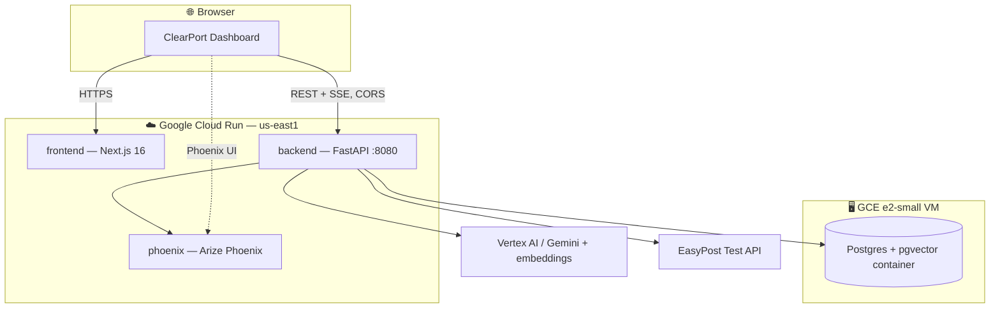
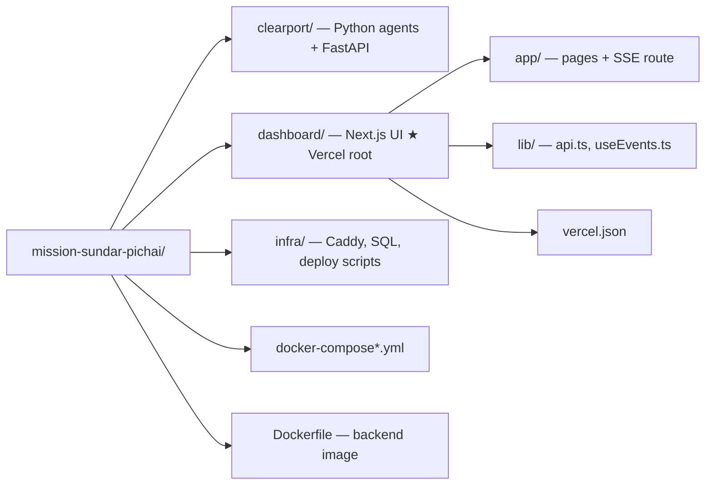
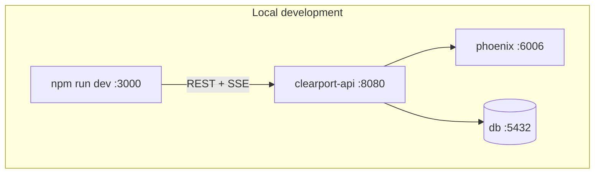
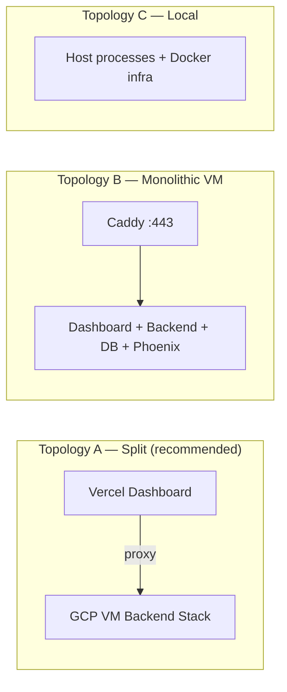
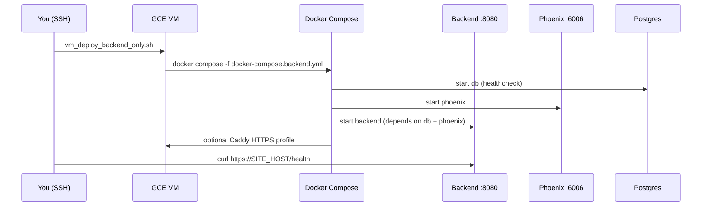
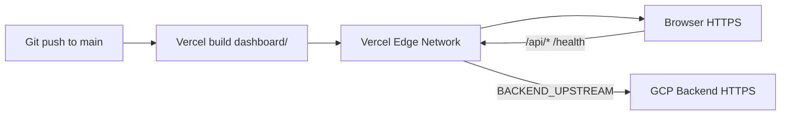
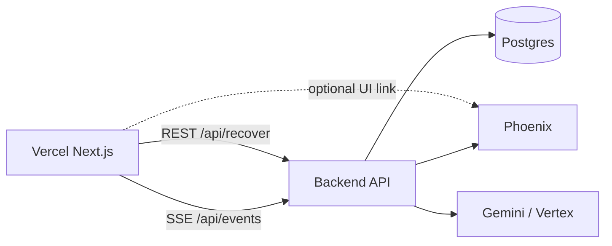
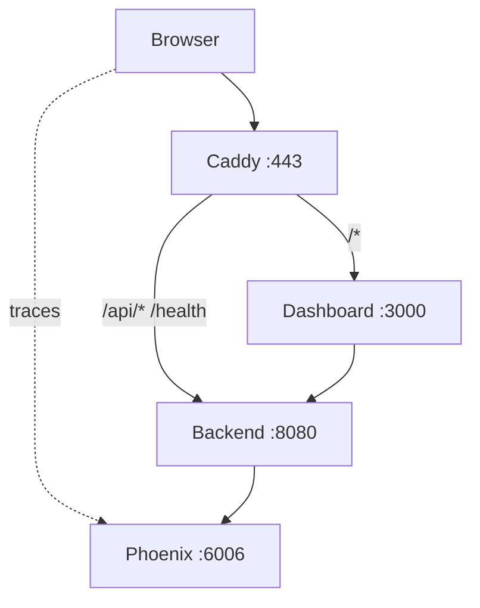
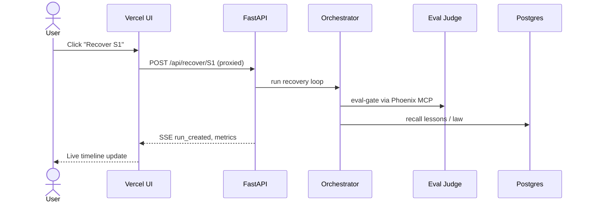
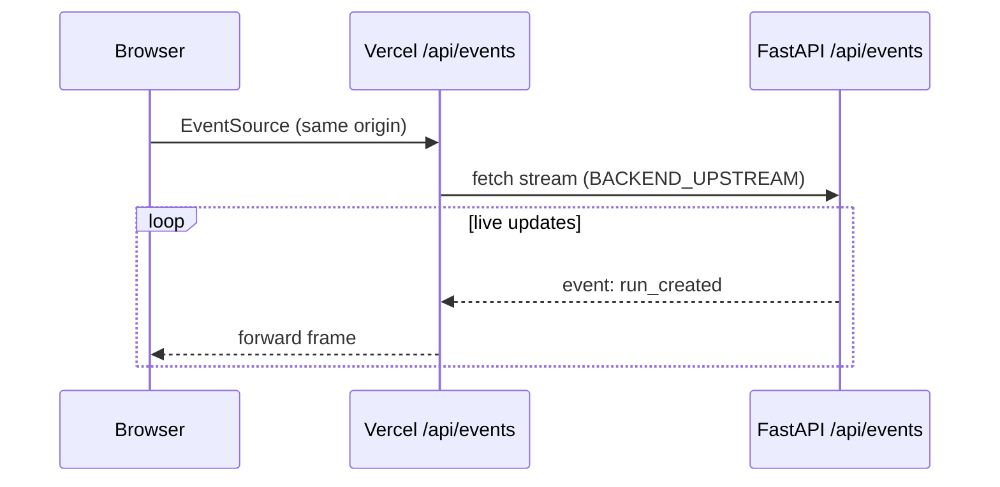

# ClearPort Deployment Guide

> **Hosted demo:** the three application services run on **Google Cloud Run** (frontend, backend, Phoenix), with **pgvector (Postgres)** as a container on a small **GCE e2-small VM**.
> The browser loads the frontend over HTTPS and calls the backend Cloud Run URL directly (CORS-enabled) for REST + SSE — no server-side proxy in the request path.

| Service | URL |
|---------|-----|
| Frontend (Next.js) | <https://frontend-676765800108.us-east1.run.app/> |
| Backend (FastAPI) | <https://backend-676765800108.us-east1.run.app/> |
| Phoenix | <https://phoenix-676765800108.us-east1.run.app/> |
| Postgres + pgvector | container on a GCE e2-small VM (private) |

---

## Table of contents

1. [Architecture at a glance](#1-architecture-at-a-glance)
2. [Container inventory](#2-container-inventory)
3. [Deployment topologies](#3-deployment-topologies)
4. [Split deploy: Vercel + GCP (recommended)](#4-split-deploy-vercel--gcp-recommended)
5. [Monolithic deploy: full VM stack](#5-monolithic-deploy-full-vm-stack)
6. [Local development](#6-local-development)
7. [Environment variable matrix](#7-environment-variable-matrix)
8. [Network & data flow](#8-network--data-flow)
9. [Visual reference (screenshots)](#9-visual-reference-screenshots)
10. [Verification checklist](#10-verification-checklist)
11. [Troubleshooting](#11-troubleshooting)
12. [Cost & operations](#12-cost--operations)

---

## 1. Architecture at a glance


ClearPort is **not a monorepo**. It is one Python package (`clearport/`) plus one Next.js app (`dashboard/`). In the hosted demo each application service runs as its own Cloud Run service, and Postgres + pgvector runs as a container on a small GCE VM.



### Repository layout



---

## 2. Container inventory

### Production — full stack (`docker-compose.prod.yml`)

| Container | Image | Host ports | Internal DNS | Purpose |
|-----------|-------|------------|--------------|---------|
| **phoenix** | `arizephoenix/phoenix:latest` | 6006, 4317 | `phoenix:6006` | Tracing, eval datasets, OTLP collector |
| **db** | `pgvector/pgvector:pg16` | *(internal only)* | `db:5432` | Law KB + lessons memory (pgvector) |
| **backend** | `${BACKEND_IMAGE}` | 8080 | `backend:8080` | FastAPI REST + SSE + agent loop |
| **dashboard** | `${DASHBOARD_IMAGE}` | 3000 | `dashboard:3000` | Next.js UI *(skip when on Vercel)* |
| **caddy** | `caddy:2-alpine` | 80, 443 | — | Single HTTPS origin for UI + API |

### Backend-only stack (`docker-compose.backend.yml`) — **use with Vercel**

| Container | Image | Host ports | Purpose |
|-----------|-------|------------|---------|
| **phoenix** | `arizephoenix/phoenix:latest` | 6006 | Tracing UI (direct link from Vercel UI) |
| **db** | `pgvector/pgvector:pg16` | internal | Memory tiers |
| **backend** | `${BACKEND_IMAGE}` | 8080 | FastAPI + agents |
| **caddy** *(profile `https`)* | `caddy:2-alpine` | 80, 443 | HTTPS API only (`/api/*`, `/health`) |

### Local dev (`docker-compose.yml`)

| Container | Ports | Purpose |
|-----------|-------|---------|
| phoenix | 6006 | Tracing UI |
| db | 5432 | Postgres |

Backend and dashboard run **on the host** (`uv run clearport-api`, `npm run dev`).



---

## 3. Deployment topologies



| Topology | Frontend | Backend stack | Best for |
|----------|----------|---------------|----------|
| **A — Split** | Vercel | GCP VM (`docker-compose.backend.yml`) | Production demos, HTTPS UI, zero dashboard ops |
| **B — Monolithic** | VM container | Same VM (`docker-compose.prod.yml`) | Air-gapped demos, single-IP firewall rules |
| **C — Local** | `npm run dev` | `uv run clearport-api` + optional compose | Development |

---

## 4. Split deploy: Vercel + GCP (recommended)

This is the path where **only the frontend container moves to Vercel**; all other services stay on GCP and are reached through server-side proxies.

### Step 0 — Prerequisites

| Requirement | Notes |
|-------------|-------|
| GCP project + VM | `e2-medium` or larger; see [`infra/deploy/setup_gcp.sh`](./infra/deploy/setup_gcp.sh) |
| Firewall | TCP **8080**, **6006**, and if using HTTPS: **80**, **443** |
| Vercel account | [vercel.com](https://vercel.com) |
| Vertex AI role | VM service account needs `roles/aiplatform.user` |

### Step 1 — Deploy backend stack on GCP

SSH into your VM and run:

```bash
cd ~/clearport-src/infra/deploy   # or clone the repo first
chmod +x vm_deploy_backend_only.sh

# Recommended: HTTPS API front door for Vercel
IP=YOUR.PUBLIC.IP ENABLE_HTTPS=1 ./vm_deploy_backend_only.sh
```

This starts **phoenix + db + backend** and optionally **Caddy** for `https://34-x-x-x.sslip.io`.



Verify:

```bash
curl -fs https://34-134-197-83.sslip.io/health
curl -fs http://YOUR.IP:6006
```

### Step 2 — Configure Vercel environment variables

In **Vercel → Project → Settings → Environment Variables** (Production + Preview):

| Variable | Example | Scope |
|----------|---------|-------|
| `NEXT_PUBLIC_API_BASE` | *(empty string)* | Browser — same-origin via Vercel |
| `BACKEND_UPSTREAM` | `https://34-134-197-83.sslip.io` | Server — rewrite target |
| `NEXT_PUBLIC_PHOENIX_BASE` | `http://34.134.197.83:6006` | Browser — Phoenix deep links |

Copy from [`dashboard/.env.vercel.example`](../dashboard/.env.vercel.example).

> **Why empty `NEXT_PUBLIC_API_BASE`?**  
> Vercel serves the UI over HTTPS. Pointing the browser at `http://IP:8080` triggers **mixed-content blocking**. Empty base URL makes the client call `/api/*` on the Vercel domain; Next.js rewrites and the SSE route handler proxy to `BACKEND_UPSTREAM` server-side.

### Step 3 — Deploy frontend to Vercel

**Live deployment (this repo):** [https://dashboard-zeta-sandy-53.vercel.app](https://dashboard-zeta-sandy-53.vercel.app)  
Set `BACKEND_UPSTREAM` in Vercel env vars to connect it to your GCP backend.

**Option A — Vercel CLI**

```bash
cd dashboard
npm install
npx vercel link          # first time: set Root Directory = dashboard
npx vercel --prod
```

**Option B — Git integration**

1. Import repo in [Vercel Dashboard](https://vercel.com/new)
2. Set **Root Directory** → `dashboard`
3. Framework preset: **Next.js**
4. Add env vars from Step 2
5. Deploy

**Option C — Deploy button**

Use the badge at the top of this doc (pre-fills root directory).



### Step 4 — How the frontend "pulls" other containers

The dashboard **never talks to Postgres or Phoenix directly** for app data. It always goes through the backend:



| Client call | Proxied to | Backend then uses |
|-------------|------------|-------------------|
| `GET /api/seeds` | FastAPI | In-memory seeds |
| `POST /api/recover/S1` | FastAPI | Agents → Gemini, Phoenix eval, DB memory |
| `GET /api/events` (SSE) | FastAPI stream | Live event bus |
| `GET /health` | FastAPI | Liveness |
| Phoenix link | Direct browser → `:6006` | Trace inspection UI |

Implementation files:

- [`dashboard/next.config.mjs`](../dashboard/next.config.mjs) — REST rewrites
- [`dashboard/app/api/events/route.ts`](../dashboard/app/api/events/route.ts) — SSE streaming proxy
- [`dashboard/lib/config.ts`](../dashboard/lib/config.ts) — API base resolution

---

## 5. Monolithic deploy: full VM stack

When you want **everything on one VM** (dashboard container included):

```bash
IP=YOUR.PUBLIC.IP ./infra/deploy/vm_deploy.sh
```

Uses [`docker-compose.prod.yml`](../docker-compose.prod.yml) + [`infra/caddy/Caddyfile`](../infra/caddy/Caddyfile).



| Surface | URL |
|---------|-----|
| App (HTTPS) | `https://34-x-x-x.sslip.io` |
| Health | `https://34-x-x-x.sslip.io/health` |
| Phoenix | `http://YOUR.IP:6006` |

See also [`infra/deploy/README.md`](./infra/deploy/README.md) for GitHub Actions + Artifact Registry flow.

---

## 6. Local development

```bash
# Terminal 1 — infra (optional)
docker compose up -d

# Terminal 2 — backend
uv run clearport-api          # http://localhost:8080

# Terminal 3 — dashboard
cd dashboard
cp .env.local.example .env.local
npm install && npm run dev    # http://localhost:3000
```

Local `.env.local`:

```env
NEXT_PUBLIC_API_BASE=http://localhost:8080
NEXT_PUBLIC_PHOENIX_BASE=http://localhost:6006
```

No `BACKEND_UPSTREAM` needed locally — the browser talks to the backend directly.

---

## 7. Environment variable matrix

### Frontend (Vercel / dashboard)

| Variable | Local | Vercel split | VM monolith |
|----------|-------|--------------|-------------|
| `NEXT_PUBLIC_API_BASE` | `http://localhost:8080` | *(empty)* | baked at Docker build |
| `BACKEND_UPSTREAM` | — | `https://SITE_HOST` | — |
| `NEXT_PUBLIC_PHOENIX_BASE` | `http://localhost:6006` | `http://IP:6006` | baked at Docker build |
| `NEXT_PUBLIC_AGENT_BUILDER_URL` | optional | optional | optional |

### Backend (GCP VM)

| Variable | Purpose |
|----------|---------|
| `GOOGLE_GENAI_USE_VERTEXAI` | `true` on VM |
| `GOOGLE_CLOUD_PROJECT` | GCP project ID |
| `DATABASE_URL` | `postgresql+psycopg://clearport:…@db:5432/clearport` |
| `PHOENIX_HOST` | `http://phoenix:6006` |
| `CLEARPORT_VECTOR_BACKEND` | `pg` in production |
| `EASYPOST_API_KEY` | Optional test key |

Full list: [`.env.example`](../.env.example) and [`clearport/config.py`](../clearport/config.py).

---

## 8. Network & data flow

### REST recovery loop



### SSE event stream



### Caddy routing comparison

| File | Routes to dashboard? | Routes to backend? |
|------|---------------------|-------------------|
| `Caddyfile` (full stack) | Yes — default `/*` | Yes — `/api/*`, `/health` |
| `Caddyfile.backend` (Vercel split) | No — 404 on `/` | Yes — `/api/*`, `/health` |

---

## 9. Visual reference (screenshots)

Capture these after deploy and save under `docs/assets/screenshots/`. Replace placeholders below.

### 9.1 Vercel deployment dashboard


**Capture:** Vercel → Project → Deployments → latest **Ready** deployment showing build logs and `clearport-dashboard` domain.

---

### 9.2 Vercel environment variables


**Capture:** Settings → Environment Variables showing `BACKEND_UPSTREAM`, empty `NEXT_PUBLIC_API_BASE`, `NEXT_PUBLIC_PHOENIX_BASE`.

---

### 9.3 ClearPort dashboard (live UI)


**Capture:** Production URL — metrics bar, seed controls, trace timeline, green SSE connection dot.

---

### 9.4 Backend health check


**Capture:** Browser or curl output of `https://YOUR-SITE/health` → `{"status":"ok","env":"cloud"}`.

---

### 9.5 Phoenix tracing UI


**Capture:** `http://YOUR.IP:6006/projects` — ClearPort trace project visible.

---

### 9.6 GCP VM container status


**Capture:** SSH terminal running `docker compose -f docker-compose.backend.yml ps` — all containers **healthy/running**.

---

### 9.7 Recovery run in progress


**Capture:** Dashboard mid-recovery — eval verdict card, field diff, risk tier visible.

---

### 9.8 Network tab (proxy verification)


**Capture:** DevTools → Network — requests to `your-app.vercel.app/api/...` (not raw IP:8080).

---

### Screenshot capture script

```bash
mkdir -p docs/assets/screenshots

# After deploy, verify endpoints:
curl -s https://YOUR-BACKEND/health | tee docs/assets/screenshots/health.json
curl -sI https://YOUR-VERCEL-APP.vercel.app/health
```

---

## 10. Verification checklist

- [ ] `curl -fs $BACKEND_UPSTREAM/health` returns `status: ok`
- [ ] Vercel deployment status **Ready**
- [ ] Dashboard loads without "backend down" banner
- [ ] SSE dot is **green** (connected)
- [ ] `POST /api/recover/S1` completes from the UI
- [ ] Phoenix opens at `NEXT_PUBLIC_PHOENIX_BASE`
- [ ] GCP: `docker compose -f docker-compose.backend.yml ps` all healthy
- [ ] Browser Network tab shows API calls on Vercel origin (split mode)

```bash
# Quick smoke test from your laptop
export VERCEL_URL=https://your-app.vercel.app
export BACKEND=https://34-x-x-x.sslip.io

curl -fs "$BACKEND/health"
curl -fs "$VERCEL_URL/health"
curl -fs "$VERCEL_URL/api/seeds" | head -c 200
```

---

## 11. Troubleshooting

| Symptom | Likely cause | Fix |
|---------|--------------|-----|
| "Backend down" on Vercel UI | Wrong `BACKEND_UPSTREAM` or backend not running | SSH → `docker ps`; fix env var; redeploy Vercel |
| SSE dot stays red | Firewall blocks 8080/443 or backend unhealthy | Open ports; check `/health`; inspect Vercel function logs |
| Mixed content errors | `NEXT_PUBLIC_API_BASE` set to `http://…` | Set to **empty**; use `BACKEND_UPSTREAM` only |
| CORS errors | Direct mode with wrong origin | Prefer split proxy mode (empty `NEXT_PUBLIC_API_BASE`) |
| Phoenix link broken | Port 6006 blocked | GCP firewall rule for tcp:6006 |
| Vertex credentials error | Missing `roles/aiplatform.user` | Attach role to VM service account |
| Let's Encrypt fails | Ports 80/443 closed | Open firewall; wait 60s; check Caddy logs |

**Logs:**

```bash
# On VM
docker logs clearport-api --tail 100
docker logs clearport-caddy-api --tail 50

# Vercel
vercel logs YOUR-DEPLOYMENT-URL
```

---

## 12. Cost & operations

| Resource | Approx. cost | Notes |
|----------|--------------|-------|
| GCE `e2-medium` | ~$25/mo | Backend + DB + Phoenix |
| Vercel Hobby | $0 | Frontend hosting |
| Vercel Pro | $20/mo | Longer SSE/function duration if needed |
| Static IP | ~$3/mo | Recommended for stable Phoenix links |
| Vertex AI / Gemini | Usage-based | Within GCP free credits for demos |

**Pause billing:**

```bash
gcloud compute instances stop clearport-vm --zone us-central1-a
```

**Resume:**

```bash
gcloud compute instances start clearport-vm --zone us-central1-a
```

---

## Quick command reference

```bash
# Backend-only on VM (Vercel split)
IP=x.x.x.x ENABLE_HTTPS=1 ./infra/deploy/vm_deploy_backend_only.sh

# Full stack on VM
IP=x.x.x.x ./infra/deploy/vm_deploy.sh

# Frontend to Vercel
cd dashboard && npx vercel --prod

# Local dev
docker compose up -d && uv run clearport-api
cd dashboard && npm run dev
```

---

## Related docs

- [Main README](../README.md) — product overview & agent architecture
- [Dashboard README](../dashboard/README.md) — UI features & local run
- [GCP deploy README](./infra/deploy/README.md) — CI/CD + Artifact Registry
- [Demo storyboard](./DEMO.md) — 3-minute judge walkthrough
